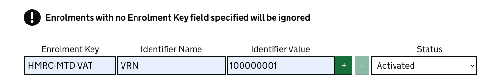
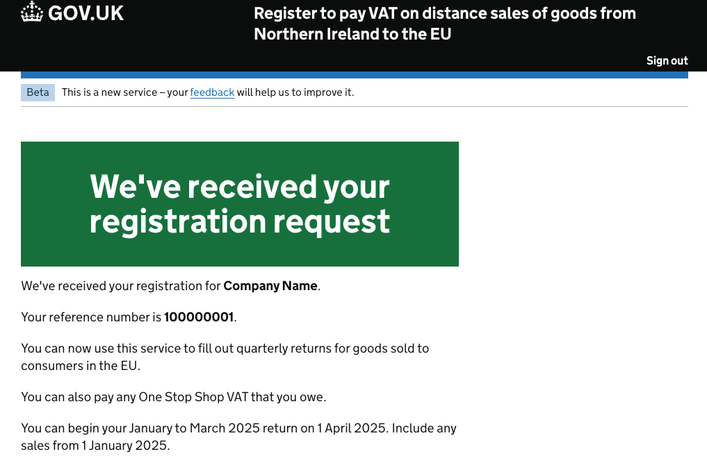

# one-stop-shop-registration-frontend

This is the repository for One Stop Shop Registration Frontend

Backend: https://github.com/hmrc/one-stop-shop-registration

Stub: https://github.com/hmrc/one-stop-shop-registration-stub

Requirements
------------

This service is written in [Scala](http://www.scala-lang.org/) and [Play](http://playframework.com/), so needs at least a [JRE] to run.

## Run the application

To update from Nexus and start all services from the RELEASE version instead of snapshot
```
sm --start ONE_STOP_SHOP_ALL -r
```

### To run the application locally execute the following:

The service needs to run in testOnly mode in order to access the testOnly get-passcodes endpoint which will generate a passcode for email verification.
```
sm --stop ONE_STOP_SHOP_REGISTRATION_FRONTEND
```
and 
```
sbt run -Dapplication.router=testOnlyDoNotUseInAppConf.Routes
```

### Running correct version of mongo
Mongo 6 with a replica set is required to run the service. If you are running a lower version, you'll need to stop your 
current mongo instance (docker ps to get the name of your mongo docker then docker stop <name> to stop)

```  
docker run --restart unless-stopped --name mongodb -p 27017:27017 -d percona/percona-server-mongodb:6.0-multi --replSet rs0
```
Configure replica set:
```
docker exec -it mongodb mongosh --eval "rs.initiate();"
```


### Using the application
To log in using the Authority Wizard provide "redirect url", "affinity group" and "enrolments" as follows:
  




It is recommended to use VRN 100000001 for a straightforward registration journey. Other scenarios can be found in
one-stop-shop-registration-stub.

To enter the registration journey, you will need to complete the initial filter questions as follows:
  1.
  
  
  2.
  
  
  3.
  

Continue through the journey completing each question through to the final check-your-answers page and submit the registration:




Unit and Integration Tests
------------

To run the unit and integration tests, you will need to open an sbt session on the browser.

### Unit Tests

To run all tests, run the following command in your sbt session:
```
test
```

To run a single test, run the following command in your sbt session:
```
testOnly <package>.<SpecName>
```

An asterisk can be used as a wildcard character without having to enter the package, as per the example below:
```
testOnly *AddTradingNameControllerSpec
```

### Integration Tests

To run all tests, run the following command in your sbt session:
```
it:test
```

To run a single test, run the following command in your sbt session:
```
it:testOnly <package>.<SpecName>
```

An asterisk can be used as a wildcard character without having to enter the package, as per the example below:
```
it:testOnly *AuthenticatedSessionRepositorySpec
```

### License

This code is open source software licensed under the [Apache 2.0 License]("http://www.apache.org/licenses/LICENSE-2.0.html").
